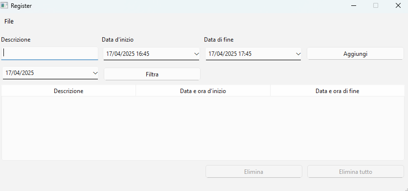

# Registro delle attività

>Elaborato del corso "Laboratorio di programmazione"

Registro di attività che si è svolto. Utilizzato pattern Observer e Model-View_Controller

> Toolkit utilizzato per la creazione della GUI: [Qt Widgets](https://www.qt.io/)

### Registro
